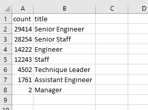
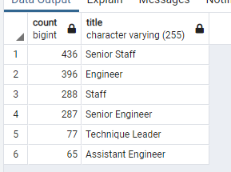

# pewlett_hackard_analysis_UT_DATA

## Resources

- Data Source:
  - [Mentorship Eligibility (csv)](./data/mentorship_eligibility.csv)
  - [Retirement Titles (csv)](./data/retirement_titles.csv)
  - [Retiring Titles (csv)](./data/retiring_titles.csv)
  - [Unique Titles (csv)](./data/unique_titles.csv)
- Software:
  - PostgreSQL 12
  - pgAdmin 4

## Purpose Overview

Determine the number of retiring employees per title, and identify employees who are eligible to participate in a mentorship program. Then, write a report that summarizes the analysis and helps prepare Bobby’s manager for the “silver tsunami” as many current employees reach retirement age.

### Deliverable 1 Instructions

- Using the included ERD as a reference, create a Retirement Titles table that holds all the titles of current employees who were born between January 1, 1952 and December 31, 1955.
  - Because some employees may have multiple titles in the database—for example, due to promotions; use the DISTINCT ON statement to create a table that contains the most recent title of each employee.
- Then, use the COUNT() function to create a final table that has the number of retirement-age employees by most recent job title.

### Deleverable 2 Instructions

- Using the included ERD as a reference,create a mentorship-eligibility table that holds the current employees who were born between January 1, 1965 and December 31, 1965.

## Results

- Over 50,000 employees are set to retire from "Senior" level positions.
- Of the nine departments within the organization, two have managers that will be retiring soon.
  - The departments are Sales and Research(*)
- Of the current total employed work-force of 240,124 employees(**), 90,398 or roughly 37% is set to retire soon.
- There are 1549 mentor ready employees within the organization currently.

## Summary

**Q1)** How many roles will need to be filled as the "silver tsunami" begins to make an impact?

- Of the current total employed work-force of 240,124 employees(**), 90,398 or roughly 37% is set to retire.

  - [Retirers (png)](./analysis/unique_titles.png)

**Q2)** Are there enough qualified, retirement-ready employees in the departments to mentor the next generation of Pewlett Hackard employees?

- For people hired within the last year, there are sufficient numbers of Mentors within similar job titles.

  - [Mentors (png)](./analysis/mentor_ready_titles.png)

  - [New Hires (png)](./analysis/new_hires_titles.png)

___

Additional Query-1 (*) - Departments with Managers Retiring

```sql
SELECT DISTINCT ON (retirement_titles_unique.emp_no) retirement_titles_unique.emp_no, retirement_titles_unique.first_name, retirement_titles_unique.last_name, retirement_titles_unique.title,
 departments.dept_name
FROM retirement_titles_unique
INNER JOIN dept_manager ON dept_manager.emp_no = retirement_titles_unique.emp_no
INNER JOIN departments ON departments.dept_no = dept_manager.dept_no
WHERE title='Manager'
ORDER BY emp_no ASC
```

Additional Query-2 (**) - Current Employees

```sql
SELECT DISTINCT ON (emp_no) emp_no, to_date
FROM dept_employee
WHERE to_date = ('9999-01-01')
```

Additional Query-3 (***) - Current Employees Hired within the Last Year, Grouped By Departments

```sql
-- New Hires
SELECT employees.emp_no, employees.first_name, employees.last_name,
 titles.title, titles.from_date, titles.to_date
INTO new_hire_titles
FROM employees
INNER JOIN titles ON employees.emp_no=titles.emp_no
WHERE employees.hire_date >= '1999-01-01'
ORDER BY employees.emp_no ASC

SELECT DISTINCT ON (emp_no) emp_no, first_name, last_name, title
INTO new_hires_titles_unique
FROM new_hire_titles
ORDER BY emp_no ASC, to_date DESC


SELECT COUNT(title) AS "count", title
INTO new_hiring_titles
FROM new_hires_titles_unique
GROUP BY title
ORDER BY "count" DESC
```

Additional Query-4 (****) - Current Employees Ready to Mentor, Grouped By Departments

```sql
SELECT COUNT(title) AS "count", title
FROM mentorship_eligibilty
GROUP BY title
ORDER BY "count" DESC
```
